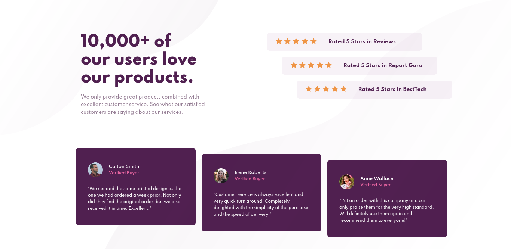
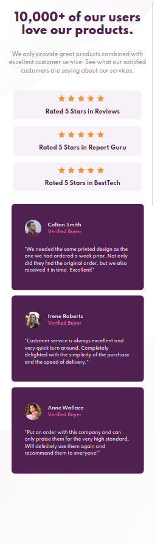

# Frontend Mentor - Social proof section solution

This is a solution to the [Social proof section challenge on Frontend Mentor](https://www.frontendmentor.io/challenges/social-proof-section-6e0qTv_bA). Frontend Mentor challenges help you improve your coding skills by building realistic projects. 

## Table of contents

- [Frontend Mentor - Social proof section solution](#frontend-mentor---social-proof-section-solution)
  - [Table of contents](#table-of-contents)
  - [Overview](#overview)
    - [The challenge](#the-challenge)
    - [Screenshot](#screenshot)
      - [Desktop view](#desktop-view)
      - [Mobile view](#mobile-view)
    - [Links](#links)
  - [My process](#my-process)
    - [Built with](#built-with)

## Overview

### The challenge

Users should be able to:

- View the optimal layout for the section depending on their device's screen size

### Screenshot

#### Desktop view

#### Mobile view

### Links

- Solution URL: [Github URL](https://github.com/hemantsirsat/challenge-5)
- Live Site URL: [Hosted on Vercel](https://challenge-5-nine.vercel.app/)

## My process

### Built with

- [React](https://reactjs.org/) - JS library

